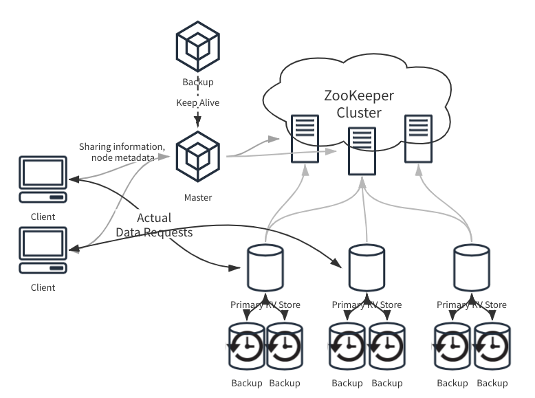

# NaiveKV

This is a distributed key-value service implemented in Go.

## Structure overview

You can find detailed description and report in [here](doc/report.md), and the defense slides [here](doc/NaiveKV.pdf).



## Getting started

### Compile protobuf

This project uses gRPC. To compile the proto buffer definitions, you'll need `protoc` and Go plugin for it.
Check out https://grpc.io/docs/languages/go/quickstart/ for detail.

The gRPC stubs are precompiled & stored in `proto`. You can recompile your own with:

```bash
cd proto
protoc *.proto --go_out=plugins=grpc:.
```

### Start processes

This project uses zookeeper to maintain metadata, so start zookeeper first:

```bash
make zookeeper-create-network
make zookeeper
```

To start master server:

```bash
make master
```

To start primary worker server with id `x`:

```bash
make primary id=x
```

To start a backup server with id `x`:

```bash
make backup id=x
```

If you want to use multiple backups for one primary, specify `backupNum`. This parameter is used to determine the port the process uses, so it should be unique among backups of the same primary:

```bash
make backup id=x backupNum=y
```

To start a client, which is a REPL:

```bash
make client
```

To start a zookeeper CLI to see what's going on under the hood:

```bash
make zk-cli
```