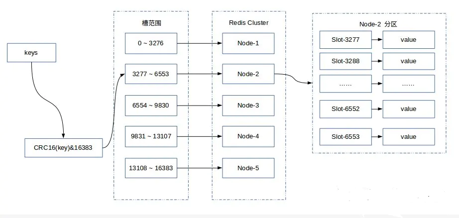
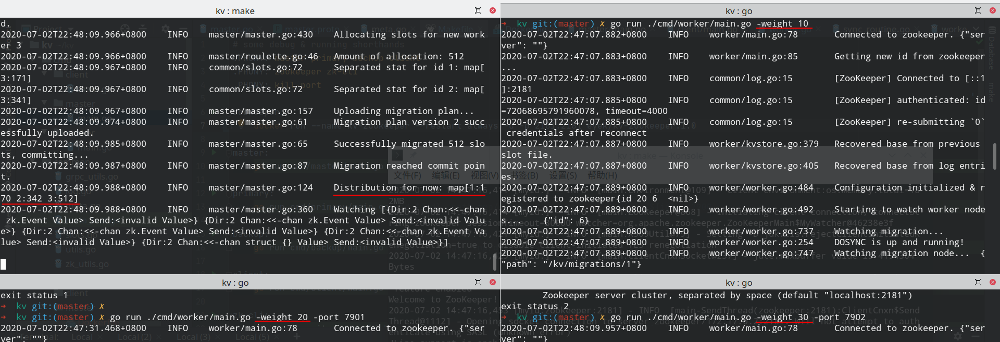
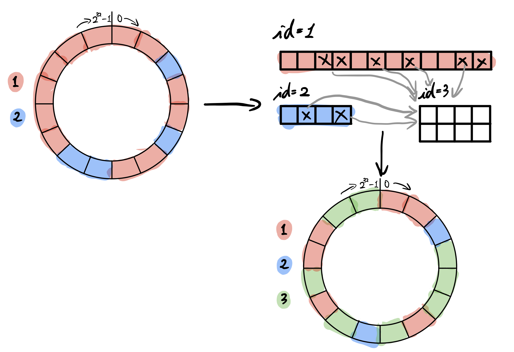
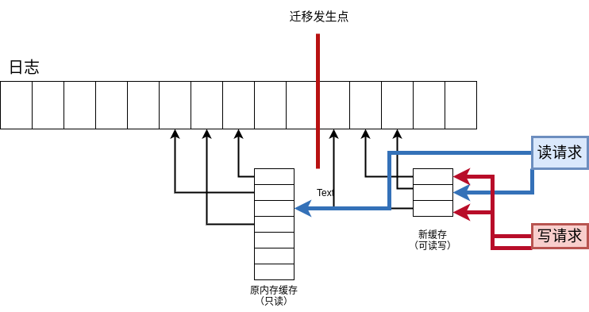

# NaiveKV-分布式系统大作业 结题报告

陈奕君 517021910387 F1703704

# 系统架构与特点


如图所示。整个系统由Master节点，Primary节点，Backup节点与ZooKeeper集群组成。在NaiveKV系统中，用户若需要进行数据查询与修改，先要向Master节点请求元数据，包括键值对的分片方式，以及Worker节点的所在位置等，随后才向对应的Worker节点进行数据请求。每个Primary Worker节点负责单独分片的数据，互不干扰，并有各自的备份节点保证高可用。

Primary与backup节点都属于Worker节点，同一组的Primary和backup节点共享一个Worker编号（`WorkerId`），而Worker编号是Master进行负载均衡、分配哈希槽的单位。

Master节点不与任何Primary节点直接通信，Master节点与Primary节点的唯一沟通方式是通过ZooKeeper下配置文件的修改。通过Zookeeper，master可通过服务注册发现服务感知正常工作在线上的节点，并探测新增节点，负责指挥集群的扩容。

各个数据节点都是一个KV数据库，并有通过日志进行数据持久化的能力。主节点与备份节点间采用半同步复制取得一致性与可用性之间的平衡，当主节点意外掉线时，各备用节点可通过选举过程决定其中一个备份节点担任新的主节点。当主节点重启再次上线时，充当主节点的备份节点与下线的主节点进行数据同步，同步完成后主节点再次上线。

接下来的章节中，笔者将逐一介绍以上设计的细节部分。

# Zookeeper配置与部署

Docker是一种部署各类互联网应用的极好方式，其具有使用部署灵活、便携高效的特点。本文中使用Docker部署了Zookeeper集群在本机。

首先在本地构建Zookeeper的Docker镜像。这一步有许多文章可以参考，最权威的是Zookeeper官方提供的构建脚本。构建脚本主要帮助我们完成了配置软件环境、下载并安装ZooKeeper的作用，与从Apache官网下载安装ZooKeeper区别不大。通过命令构建后，可通过`docker image ls`看到构架好的镜像`eyek/kv-zookeeper`。

```bash
➜  zookeeper git:(master) ✗ pwd
/home/eyek/kv/deploy/zookeeper
➜  zookeeper git:(master) ✗ ls
docker-entrypoint.sh  Dockerfile  zoo1.cfg  zoo2.cfg  zoo3.cfg
➜  zookeeper git:(master) ✗ docker build -t eyek/kv-zookeeper:1.0 .
Sending build context to Docker daemon  9.728kB
Step 1/15 : FROM openjdk:11-jre-slim
 ---> 973c18dbf567
Step 2/15 : ENV ZOO_CONF_DIR=/conf #...以下省略
```

构建镜像后，我们需要分别准备三份配置文件提供给ZooKeeper集群的三个节点，以构建Replicated模式下的ZooKeeper集群。以其中一份`zoo1.cfg`为例：

```
clientPort=2181
dataDir=/data
dataLogDir=/data/log
# 默认值2000ms，为使服务宕机发现更加迅速，这里设为500ms
tickTime=500
# 以下均为默认配置值
initLimit=5
syncLimit=2
autopurge.snapRetainCount=3
autopurge.purgeInterval=0
maxClientCnxns=60
# 集群中三个节点的地址配置，其中zoo2与zoo3为Docker分配的域名
server.1=0.0.0.0:2888:3888;2181
server.2=zoo2:2888:3888;2181
server.3=zoo3:2888:3888;2181
```

比较重要的一点在于需要为每个节点单独设置自身及其他所有节点的域名与连接信息。此外，为使服务宕机发现更为迅速，这里调快了ZooKeeper的默认心跳频率，由2000ms提至500ms。

为在Replicated模式下使用ZooKeeper集群，还需要为每个集群节点设置`MY_ZOO_ID`环境变量。可由以下命令开启ZooKeeper容器集群：

```bash
➜  zookeeper git:(master) ✗ pwd
/home/eyek/kv/deploy/zookeeper
➜  zookeeper git:(master) ✗ docker network create zk
➜  zookeeper git:(master) ✗ docker run --name zk1 --restart always -d -v $(pwd)/zoo1.cfg:/conf/zoo.cfg -e "ZOO_MY_ID=1" -p 2181:2181 --net zk eyek/kv-zookeeper:1.0
➜  zookeeper git:(master) ✗ docker run --name zk2 --restart always -d -v $(pwd)/zoo2.cfg:/conf/zoo.cfg -e "ZOO_MY_ID=2" -p 2182:2181 --net zk eyek/kv-zookeeper:1.0
➜  zookeeper git:(master) ✗ docker run --name zk3 --restart always -d -v $(pwd)/zoo3.cfg:/conf/zoo.cfg -e "ZOO_MY_ID=3" -p 2183:2181 --net zk eyek/kv-zookeeper:1.0
➜  zookeeper git:(master) ✗ docker container ls
CONTAINER ID        IMAGE                   COMMAND                  CREATED              STATUS              PORTS                                                  NAMES
1897dd60f7e8        eyek/kv-zookeeper:1.0   "/docker-entrypoint.…"   About a minute ago   Up About a minute   2888/tcp, 3888/tcp, 8080/tcp, 0.0.0.0:2183->2181/tcp   zk3
d8134581bd92        eyek/kv-zookeeper:1.0   "/docker-entrypoint.…"   About a minute ago   Up About a minute   2888/tcp, 3888/tcp, 8080/tcp, 0.0.0.0:2182->2181/tcp   zk2
927ec8157b86        eyek/kv-zookeeper:1.0   "/docker-entrypoint.…"   About a minute ago   Up About a minute   2888/tcp, 3888/tcp, 0.0.0.0:2181->2181/tcp, 8080/tcp   zk1
```

可看到ZooKeeper集群在Docker环境下运行，并分别暴露到本机namespace下2181，2182及2183接口。

在NaiveKV系统中，Master节点与Primary节点之间使用ZooKeeper中的数据进行交互，有时Primary与Backup，Backup与Backup之间的交互也会通过ZooKeeper完成。NaiveKV主要将以下元数据存储在ZooKeeper中（以目录形式呈现）

- `/kv`
    - `workers`目录保存各Worker单位的Primary节点与Backup节点服务注册信息，与节点配置权重；
    - `migrations`目录保存每轮数据迁移的计划；
    - `election`目录提供给备份节点进行新主节点选举；
    - `masters`目录保存master节点及其备份节点注册信息；
    - `slots`保存当前的哈希槽分配计划；
    - `version`保存当前哈希槽分配的版本号；
    - `workerId`为新加入的worker节点提供自增的worker编号。

# 详细设计

---

## 持久化层

笔者认为，在考虑集群高可用性之前，应首先考虑单点的高可用性。因此，为KV存储单点加上持久化能力，是很有必要的。笔者在设计NaiveKV之初便考虑了这个问题，并实现了一个基于redo log的KV存储系统。在写请求返回之前，KV节点的持久化层会将更改以日志形式顺序刷入磁盘并提交，随后再返回结果（即预写式日志WAL）。

NaiveKV中的WAL实现与Sqlite中比较相似，即一个Base文件，一个顺序写的日志文件和内存中的查询缓存。不过由于NaiveKV中并没有数据Rollback的需求，日志文件并未映射到内存中，为方便直接将键值对存储到内存中的查询缓存。只有在遇到节点崩溃并重启的情况下，WAL日志会被重新读取并重建数据库，保证数据不丢失。

为了支持后文中将要描述的负载均衡策略与主备迁移策略，NaiveKV中的WAL日志还加上了版本号与并发事务的支持。故NaiveKV中一条日志的形式大约是这样的：

```bash
<operation> <arg1> <arg2> <transcationNumber> <versionNumber>
```

其中当transactionNumber不为零（即在事务中）时，versionNumber被省略。当有并发事务发生时，持久化层为不同的事务分配不同的事务编号并将其刷进磁盘，当事务被commit时才将版本号自增， 表示事务提交。对于不在事务中的请求，每条日志都会有版本号。这一部分可参见`worker/kvstore.go`。

## 负载均衡策略

NaiveKV使用哈希槽进行一致性分配。哈希槽是一致性哈希的简化版本，将哈希空间分为等长的分段，以分段作为最小分配粒度。相对一致性哈希，哈希槽可控性更强，且在有统一的配置节点的情况下有明显优势。Redis的各种集群方案，包括Codis、TweamProxy、Redis Cluster，均采用了哈希槽。淘宝的分布式KV系统Tair，360的分布式KV系统Zeppelin也采用了哈希槽。下图为redis cluster中为集群节点分配16384个哈希槽的实例。



NaiveKV中将哈希空间分为1024个等宽的哈希槽（这样的粒度应该能较好地为100个节点做负载均衡）。当有新节点加入时，NaiveKV为其分配定量的哈希槽。哈希槽可以适应不同的策略，NaiveKV中为不同的节点的配置可能不同出发设想，可为不同的节点**设定不同的权重**。每个Worker所分配到的哈希槽数量与其权重成正比。下图例子中，三个Primary节点的权重为1:2:3，Master为他们精确分配了对应的哈希槽数量进行负载均衡处理。



下图为槽分配的一个实例。为了方便，图中仅有16个哈希槽位，初始节点有两个，其权重是1:3。现在加入一个权重为4的节点，使三个节点分别占2，6，8个槽。



## 主间迁移策略

主间哈希槽迁移发生在有新节点加入时，Master节点需要为其分配新的哈希槽，这些哈希槽由集群中已存在的节点占有。迁移槽时必然会发生数据迁移。NaiveKV的槽迁移策略是，**将数据迁移的压力按权重平摊到集群中各节点上**。故当有一个权重为$k_n$的新节点$N$加入集群时，NaiveKV采用如下算法计算每个节点所需要迁移的槽：

```bash
对集群中所有的老节点N_o:
	 计算权重之和，记为k_a.
总共需要迁移的槽数量为k_n/(k_n+k_a)*1024，记为n_m.
对集群中每个老节点N_o，其权重为k_o:
		收集该节点目前占有的所有的哈希槽，将其顺序打乱。
    在打乱的哈希槽中，选出其中n_m*k_o/k_a个，迁移到新节点。
```

即一个选取数量确定，选取节点不确定的随机算法。

Master根据新来节点的权重与当前集群情况计算好每个节点的迁移计划后，将每个节点的迁移计划分开，存储到ZooKeeper中（`/kv/migration/当前迁移版本号`目录下）。各节点监听其对应的迁移计划Znode，拿到迁移计划后便与新节点建立连接进行数据迁移。

数据迁移过程涉及到两个主要问题：

- All-or-nothing一致性。迁移过程中若迁移两方任何一方断连，需要保证可以重新连接重新开始，并且不丢数据、不错数据；
- 并发：迁移过程中不宜锁住迁移两方节点。由于迁移过程整个集群都参与，数据迁移加锁会导致整个集群短暂不可用。

笔者将数据迁移过程一分为二：全量复制与增量复制。全量复制即一开始的过程，数据迁移从零开始；增量复制即全量复制之后的过程，老节点将新收到的应该迁移的用户更改与新节点同步。

在全量复制过程中，笔者想到解决all-or-nothing的方法是使用事务机制：只有在所有数据都写入并commit了以后，全量数据才算有效，若缺少commit块则事务无效，可保证迁移过程的原子性。并且，使用事务进行复制时接收方只有在commit以后才需要回复消息，也可提升网络通信效率。对于并发问题，可使用另外一层内存中缓存处理读写问题，使迁移发生点之前所有数据只读，减少读写冲突提高效率。



增量复制即全量复制之后的过程，这时事实上老节点与新节点这一部分的数据已经同步了，于是对新的请求使用同步的方式进行迁移保证数据一直同步，随时可以断开。同步复制过程中，老节点先将新的操作同步到新节点，新节点提交以后老节点再刷盘，请求这才返回。这可以保证增量复制过程中不丢数据，且由于增量复制过程不如全量复制数据来的密集，这样做的性能也可接受，同时也是原子性，断开可重新开始的。

全量复制结束，各节点进入增量同步复制后，会将master事先存在ZooKeeper中的信号量（semaphore，节点名称`completeSem`）原子地减一，表示已完成。Master持续监听ZooKeeper中的信号量，为零时更新ZooKeeper中的数据迁移版本号`version`与数据迁移表`slots`。所有节点监听到`version`的变化，断开数据迁移的连接，代表该轮数据迁移结束。

考虑不同的崩溃情况，可列举如下几个：

- 全量复制过程中两方中任何一方崩溃。崩溃一方重启后，重新开始全量复制过程；
- 同步复制过程中数据源节点崩溃。若数据源有备份，备份节点继续与目的节点进行复制；若无备份，则崩溃过程中没有新数据加入，重启继续同步复制。
- 同步复制过程中目的节点崩溃。目的节点重启后，与数据源节点同步版本号，重新从全量复制开始。

注意，由于数据源节点与目的节点的版本号是不一致的，所以目的节点在全量复制完成与同步复制过程中，需要显式地记录数据源节点的版本号。

数据迁移的过程，可用下图来表示。

.png)

## 主备同步方式

主备同步与数据迁移其实有异曲同工之妙。NaiveKV采用一主多备的备份配置（一般是一主两备），主备同步也分全量复制与增量复制，前者用事务保证原子性与效率（主要是效率），后者保证实时性与较好的一致性。但主备复制过程中，若主服务器每次请求提交都需要等待所有备份节点提交，这在实际生产环境中会造成严重的性能降低。若完全不管一致性，主备之间采用异步复制，则主备之间的数据延迟不可避免。为此NaiveKV中采用一种折衷方法：半同步复制，即**所有的备份中只要有一份返回了ACK，则可将该次事务提交**，所花时间约是与所有备份的最短的网络延迟，同时保证至少一份备份是一致的。

在半同步复制下，当主节点宕机，所有备份节点需要进行选举，选出版本号最高的备份节点，一致性最好。这个过程在ZooKeeper的`/kv/election`目录下进行，具体方式是所有备份在目录下添加节点，节点名中附上版本号，当所有备份都加入节点后就可知道版本号最高的是哪一个，也即新的主。主当选以后将自己注册的节点名字改为Primary，并负责清理`/kv/election`目录。

在旧的主重启之前，这个备份会替主进行读写服务。当宕机的主重启并重新注册，充当主的备份节点应当将主还给旧的主。在这之前，充当主的备份会与旧主进行增量数据同步，当同步以后旧的主将自己注册的节点名改为Primary，充当主的备份退位。设计成如此是考虑到生产环境中备份机器比主机器的硬件配置要差，往往不能直接顶替主。

考虑不同的崩溃情况，可列举如下几个：

- 主崩溃。备份节点进行选举并顶替主。
- 单个或多个备份崩溃。无事发生，若所有备份均崩溃则主会关闭主备同步。当备份重新上线时，备份与主同步版本号并重新开始全量复制与增量复制。
- 主与一个或多个备份同时崩溃。这个情况下，剩下的备份无法100%保证是与主同步的，即可能有数据不一致（如下图）。因此，选举出的备份会服务降级，仅允许数据读请求。

.png)

## master节点高可用

Master节点负责client的所有元数据请求，并负责指挥数据迁移过程。Master节点是有状态的，但这些状态实际都是ZooKeeper中数据的缓存，故可以认为Master节点是无状态的。因此，Master节点的高可用设计就比较简单了。ZooKeeper中的`/kv/master`目录下有所有Master注册的Empheral Sequential节点，若考虑系统中同一时间只能有一个master指挥迁移过程，序号最小的节点便是拿到排他锁的master节点，即当前master节点。（实际上可有多个master同时服务客户端请求，但出于方便考虑没有这么实现。）

## client端实现与一个小优化

Client端是一个REPL，背后与master节点和worker节点通信，进行KV数据查询。对数据进行查询时，client端首先询问master节点数据所在节点位置，随后与数据节点建立连接并发送请求。对于相同节点的数据连接，client会维持连接，而不是单个请求完成以后即删除连接。

这样简单的做法问题在于，由于每个请求前都要询问一遍master，master成为了性能瓶颈。为此笔者提出一个优化：client端从master端请求当前的哈希槽分配表并缓存在本地，每次请求时不经过master，直接向worker发出。向worker发出请求中，需要带上哈希槽分配表的版本号。worker在处理请求时，需检查哈希槽分配表的版本号，若版本落后则拒绝client的请求，client需要从master重新获取哈希槽分配表。图示如下：

.png)

## 实现与部署

NaiveKV使用Go语言实现，包含Master，Worker与Client，采用了Go下比较常用的Zookeeper绑定`samuel/zookeeper`，并使用gRPC框架，提供exactly once， sequential的远程调用。由于时间匆忙，项目没有使用Docker包装，但Go程序可直接启动，具体启动与部署方式可参考项目的readme与makefile。